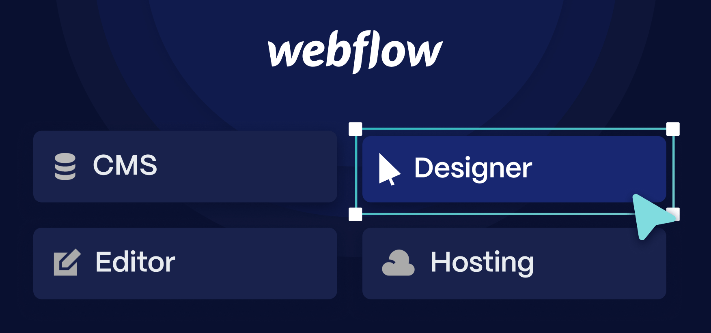

### Development Approaches

Our approach to modern website development is tailored to meet the diverse needs of our clients. We offer both low-code/no-code platforms for rapid development and custom development for more complex requirements.

### Low-Code/No-Code Platforms

For clients who prefer rapid development and ease of maintenance, we leverage platforms like Webflow and WordPress.

- **Webflow**: Webflow allows for visually driven development with powerful design capabilities, enabling us to create visually stunning websites quickly. It offers a user-friendly interface and a robust CMS for easy content management.

  

- **WordPress**: WordPress provides extensive plugins and themes, making it highly customizable and scalable. It's ideal for clients who need a flexible website with a wide range of functionalities. With a large community and continuous updates, WordPress ensures long-term support and improvements.

### Custom Development

For clients with specific needs that require more control and customization, we opt for custom development. This approach allows us to build tailored solutions that precisely match client requirements.

- **Gatsby**: Gatsby is perfect for static site generation, offering fast load times and robust performance. It uses React, allowing us to create dynamic and responsive user interfaces. Gatsby is ideal for SEO-focused websites due to its static nature and optimized performance.

- **Next.js**: Next.js is suitable for server-side rendering and dynamic websites that require advanced functionalities. It offers a hybrid approach, supporting both static and server-side rendering, making it versatile for various types of projects. Next.js provides excellent performance and scalability, ensuring a smooth user experience.

By combining these development approaches, we ensure that our clients receive the best solution tailored to their specific needs, whether it's a rapid deployment with low-code/no-code platforms or a highly customized and performant website through custom development.
